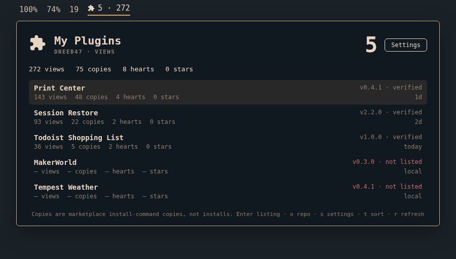

# My Plugins

An [Omarchy](https://omarchy.org) bar dashboard of the plugins **you** publish: marketplace views, hearts, and install-command copies, plus GitHub stars and verification.

It is not a store. For browsing everyone else's listings use [Bazaar](https://github.com/jeremylongshore/omarchy-bazaar-entry). For enable/disable/update of what is installed, use [Omaplug](https://github.com/fross100/omaplug). This is the owner view those two do not have.



## What the numbers mean

The marketplace publishes anonymous aggregates. This widget only reads them.

| Shown as | Source | Meaning |
|---|---|---|
| Views | `api.omarchyplugins.com/v1/stats` | Marketplace detail-page views |
| Hearts | same | Anonymous likes |
| Copies | same | Successful install-command copies — **not installs, not downloads** |
| Stars | catalog | GitHub stars |
| Verified | catalog | Marketplace snapshot verification |

Nothing about you is sent. Both feeds are unauthenticated public JSON. The catalog is `https://plugins.omarchy.org/catalog.json`; stats are `https://api.omarchyplugins.com/v1/stats`.

## Who it shows

By default it infers your GitHub username from plugins already installed under `~/.config/omarchy/plugins/` (`io.github.<user>.*`). Open the popup and click **Settings** (or press `s`) to pin a different user and to choose which totals appear on the bar. The username field is prefilled with the guess; Save writes it to this widget's `shell.json` entry. Leave the username blank and save to go back to auto-detect.

Optional extra matchers, if you still want them from the CLI:

- `authorName` — marketplace `author` field (e.g. `David Reed`)
- `idPrefix` — plugin id prefix

Installed plugins that match you but are **not listed** still appear when `showUnlisted` is on, with em dashes instead of stats.

## Install

```
omarchy plugin add https://github.com/dreed47/omarchy-my-plugins.git --enable --yes
```

Then add **My Plugins** to the bar from the widget menu, or:

```
omarchy bar move io.github.dreed47.my-plugins --section right
```

## Using it

| Where | Action |
|---|---|
| Bar, left click | Open the list |
| Bar, right click | Desktop notification with the totals |
| Bar, middle click | Refresh catalog and stats now |

Keyboard, while the popup is open:

| Key | Action |
|---|---|
| `j` / `k` or arrows | Move |
| `Enter` | Open the marketplace listing (or the repo if it is not listed) |
| `o` | Open the GitHub repo |
| `s` | Settings (GitHub user) |
| `t` | Cycle sort (views, copies, hearts, stars, newest, name) |
| `r` | Refresh |
| `Esc` | Close settings, or close the popup |

Left-click a row opens the listing; right-click opens the repo.

## Settings

```
omarchy bar set io.github.dreed47.my-plugins githubUser dreed47
omarchy bar set io.github.dreed47.my-plugins sort Views
omarchy bar set io.github.dreed47.my-plugins showUnlisted On
```

| Key | Default | What it does |
|---|---|---|
| `githubUser` | *(auto)* | GitHub username whose listings to show |
| `authorName` | *(empty)* | Also match this marketplace author string |
| `idPrefix` | *(empty)* | Also match plugin ids with this prefix |
| `sort` | `Views` | Views, Copies, Hearts, Stars, Newest, Name |
| `showUnlisted` | `On` | Include local owner plugins with no catalog entry |
| `barCount` | `On` | Plugin count on the bar pill |
| `barViews` | `On` | Views total on the bar pill |
| `barCopies` | `Off` | Copies total on the bar pill |
| `barHearts` | `Off` | Hearts total on the bar pill |
| `barStars` | `Off` | GitHub stars total on the bar pill |

Catalog refreshes at most every 6 hours (conditional GET). Stats refresh every 30 minutes. Cache lives in `~/.local/state/omarchy/my-plugins/`.

## Remove

Remove the widget from the bar, then:

```
omarchy plugin remove io.github.dreed47.my-plugins --yes
rm -rf ~/.local/state/omarchy/my-plugins
```

## Requirements

- Omarchy 4.x (`omarchy-shell`)
- `curl` and `jq` (both ship with Omarchy)
